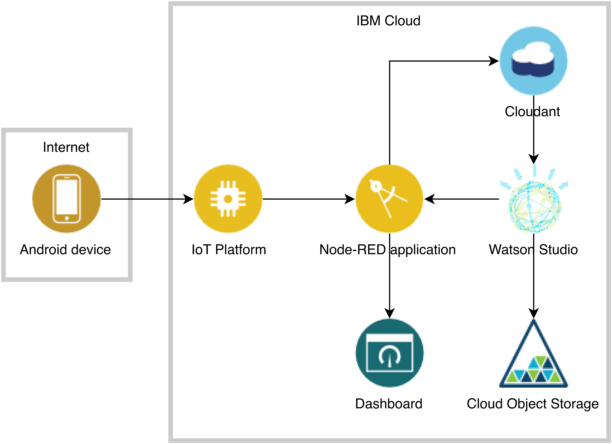

# IoT, Cloud and AI tutorial

Integration of Internet of Things, Cloud Computing and Artificial Intelligence.

## Introduction

This tutorial will teach you how to connect an Android device to the cloud and develop analytics models to analyse sensor data.
By the end of this tutorial you should be able to set up your own IoT hub for streaming, storing and processing device data, besides becoming familiar with

* Node-RED
* IBM Cloud
* MQTT protocol
* IBM Watson Studio
* Cloundant database
* Continuous Delivery
* Cloud Object Storage
* IBM Watson IoT Platform
* Application Starter Kits
* Cloud Foundry applications

## Prerequisites

* Android smartphone
* Internet connection

## Estimated time

From 1h to 2h, depending on the familiarity of the reader with the concepts.

## Steps

1. Read [**Create IBM Cloud account and install IoTool apps**](tutorial/1-SETUP.md) and follow the steps.
    1. [Set up IBM Cloud account](tutorial/1-SETUP.md#set-up-ibm-cloud-account)
    1. [Install Android apps](tutorial/1-SETUP.md#install-android-apps)
1. Read [**Use IBM Watson IoT Platform**](tutorial/2-PLATFORM.md) and follow the steps.
    1. [Create IBM Watson IoT Platform instance](tutorial/2-PLATFORM.md#create-ibm-watson-iot-platform-instance)
    1. [Connect your device to IBM Watson IoT Platform](tutorial/2-PLATFORM.md#connect-your-device-to-ibm-watson-iot-platform)
    1. [Monitor sensor data in the platform](tutorial/2-PLATFORM.md#monitor-sensor-data-in-the-platform)
1. Read [**Use Node-RED programming tool**](tutorial/3-NODERED.md) and follow the steps.
    1. [Deploy Node-RED starter kit](tutorial/3-NODERED.md#deploy-node-red-starter-kit)
    1. [Connect Node-RED app to IBM Watson IoT Platform](tutorial/3-NODERED.md#connect-node-red-app-to-ibm-watson-iot-platform)
    1. [Create a simple Node-RED app](tutorial/3-NODERED.md#create-a-simple-node-red-app)
    1. [Test simple Node-RED app](tutorial/3-NODERED.md#test-simple-node-red-app)
1. Read [**Create live dashboard on Node-RED**](tutorial/4-DASHBOARD.md) and follow the steps.
    1. [Create live dashboard with acceleration data](tutorial/4-DASHBOARD.md#create-live-dashboard-with-acceleration-data)
    1. [Enable linear acceleration sensors on your phone](tutorial/4-DASHBOARD.md#enable-linear-acceleration-sensors-on-your-phone)
    1. [Enhance live dashboard with linear acceleration data](tutorial/4-DASHBOARD.md#enhance-live-dashboard-with-linear-acceleration-data)
    1. [Add rudimentary shake detection to live dashboard](tutorial/4-DASHBOARD.md#add-rudimentary-shake-detection-to-live-dashboard)
1. Read [**Build an AI classifier using IBM Watson Studio**](tutorial/5-MODEL.md) and follow the steps.
    1. [Store training data on Cloundant](tutorial/5-MODEL.md#store-training-data-on-cloundant)
    1. [Create IBM Watson Studio project](tutorial/5-MODEL.md#create-ibm-watson-studio-project)
    1. [Create Cloudant credentials for IBM Watson Studio](tutorial/5-MODEL.md#create-cloudant-credentials-for-ibm-watson-studio)
    1. [Train classifier model](tutorial/5-MODEL.md#train-classifier-model)
    1. [Test classifier model](tutorial/5-MODEL.md#test-classifier-model)
    <!-- 1. [Deploy classifier model](tutorial/5-MODEL.md#deploy-classifier-model) -->
    <!-- 1. [Consume classifier model](tutorial/5-MODEL.md#consume-classifier-model) -->

## Summary

Congratulations, you have now built your own IoT hub for streaming, storing and analysing sensor data entirely on the cloud!
If you want to keep learning about IoT, take a look at the link below where you can learn how to do something similar to what you just did but replacing your Android device by a single-board IoT device.

## Related links

* [Analyze IoT ESP8266 sensor data](https://developer.ibm.com/tutorials/connect-a-soil-sensor-send-data-to-the-cloud-cfc-starter-kit-1/)